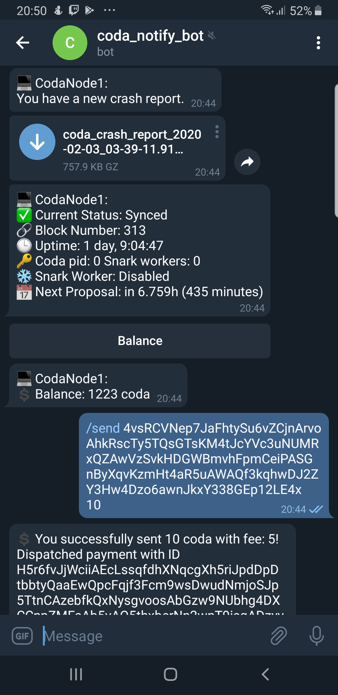

# Codas
Python3 script to observe or control your [Coda](https://codaprotocol.com/docs/node-operator) daemon.

### Features:
- Running script to observe (not control) coda daemon
- Auto control coda daemon:
  - restart after too long synchronization (if status gets stuck at Bootstrap, Catchup, Listening, Offline)
  - stop and start snark worker depend on proposal time
  - start after crash
- Control coda daemon from telegram:
  - stop daemon
  - get balance
  - send coda
- Send notifications to telegram bot
- Sending new crash reports to telegram bot

### Prerequisites
```
sudo apt install curl -y
pip3 install python-telegram-bot --upgrade
```

### Installation
From source
```bash
git clone https://github.com/spdd/codas.git
cd codas
python3 setup.py install
```

### Usage

Open settins.conf file and fill CodaParams section.

```
~$ python3 codas.py -h

```
```
usage: codas.py [-h] [-o] [-r] [-m MESSENGER]

optional arguments:
  -h, --help            show this help message and exit
  -o, --disable_observe
                        Observe coda daemon, but not restart or stop
  -r, --send_report     Send crash reports to messengers
  -m MESSENGER, --messenger MESSENGER
                        Use to send notifications to messengers
```

Usage examples:

Run script to observe coda daemon and send notifications and crash reports to telegram
```
~$ python3 codas.py --send_report -m telegram
```

Run to control coda daemon from script (start, stop) and send notifications and crash reports to telegram
```
~$ python3 codas.py --disable_observe --send_report -m telegram
```
You will get something like that:


### How to create telegram bot?
1. Find in Telegram **@BotFather** 
2. Start conversation /start
3. Enter /newbot
4. Get **YOUR_BOT_TOKEN**

### How to get telegram bot chat id?
1. Start conversation with your new bot
2. Send a dummy message to the bot.
3. Go to following url https://api.telegram.org/bot<**YOUR_BOT_TOKEN**>/getUpdates
4. Find for "chat":{"id":<**YOUR_BOT_CHAT_ID**>...

Open settins.conf file and fill Telegram section:
```
token = <YOUR_TOKEN>
chat_id = <YOUR_CHAT_ID>
```

### License
[MIT](https://choosealicense.com/licenses/mit/)
